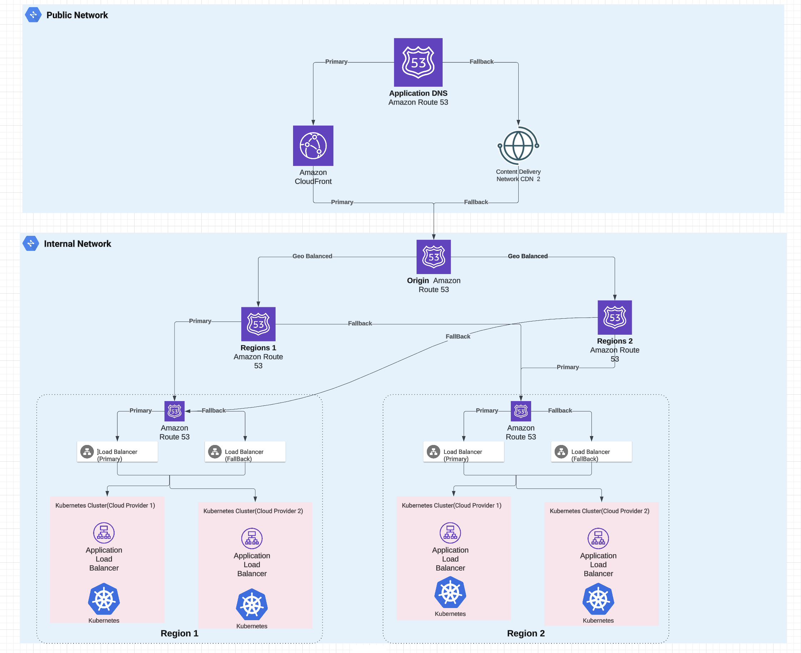

# News App

This project is a full-stack JavaScript application for fetching and displaying news articles. It leverages Next.js for the frontend, Node.js with Express for the backend, and integrates with external APIs for news data. The project is containerized using Docker and uses Terraform for infrastructure management.

## Features

- Server-Side Rendering (SSR) with Next.js
- API integration for fetching news articles
- Docker for containerization
- Terraform for infrastructure as code
- Jest for testing
- GitHub Actions for CI/CD

## Setup Development Environment

1. **Clone the repository**:

   ```sh
   git clone https://github.com/yourusername/news-app.git
   cd news-app
   ```

2. **Install dependencies**:

   ```sh
   yarn
   ```

3. **Set up environment variables**:
   Create a `.env.local` file in the root directory and add your environment variables:

   ```env
   NEWS_API_KEY=your_api_key_here
   ```

4. **Run the development server**:

   ```sh
   yarn dev
   ```

5. **Run tests**:

   ```sh
   yarn test
   ```

6. **Run Lints**:

   ```sh
   yarn lint
   ```

7. **Build the project**:
   ```sh
   yarn build
   ```

## Folder Structure

- **components/**: Contains React components used in the application.
  - **article/**: Components related to displaying articles.
  - **layout/**: Layout components like Header and Footer.
- **pages/**: Next.js pages.
- **services/**: Service modules for handling API calls and their business logic.
  - **news/**: Modules related to fetching and processing news data.
- **.vscode/**: Visual Studio Code settings.
- **.husky/**: Husky configuration for Git hooks.
- **public/**: Static assets.
- **.env.local**: Environment variables.
- **package.json**: Project metadata and scripts.
- **tsconfig.json**: TypeScript configuration.

## Usage

1. **Fetch news articles**:
   The application fetches news articles from an external API and displays them on the homepage.

2. **Navigate through articles**:
   Users can click on articles to read more details.

## Contributing

1. **Fork the repository**.
2. **Create a new branch**:
   ```sh
   git checkout -b feature-branch
   ```
3. **Make your changes**.
4. **Commit your changes**:
   ```sh
   git commit -m "Add new feature"
   ```
5. **Push to the branch**:
   ```sh
   git push origin feature-branch
   ```
6. **Create a pull request**.

## Deployment

This project includes a `./terraform` folder that contains Infrastructure as Code (IAC) for deploying the application to Kubernetes. Deployment is straightforward and can be accomplished using a few simple yarn commands.

To deploy the application, follow these steps:

> **Note:** Ensure to update the `NEWS_API_KEY` secret in the `terraform/k8/configmap.tf` file before deployment.

1. Initialize the Terraform configuration:

   ```sh
   yarn terraform:init
   ```

2. Plan the deployment:

   ```sh
   yarn terraform:plan
   ```

3. Apply the deployment:
   ```sh
   yarn terraform:apply
   ```
   For testing this on a local machine, I recommend using [kind](https://kind.sigs.k8s.io/docs/user/quick-start/).
   > **Note:** When deploying locally, make sure to comment out `hpa.tf` and `pdb.tf` as [kind](https://kind.sigs.k8s.io/docs/user/quick-start/) does not support these by default out of the box.

## Infrastructure Architecture.



This architecture is designed for a highly available, scalable, and resilient multi-region application deployment using AWS services and Kubernetes clusters.

### Key Features:

- Global Resilience:
- Traffic is geo-balanced between regions with failover mechanisms for DNS and load balancers.
- Kubernetes clusters are deployed across different cloud providers within each region to mitigate provider-specific outages.
- Multiple fallback mechanisms at every level (DNS, load balancer, and cluster) ensure high availability.

### Motivation Behind the Architecture

1. High Availability
2. Scalability
3. Multi-Cloud Redundancy
4. Low Latency
5. Disaster Recovery
